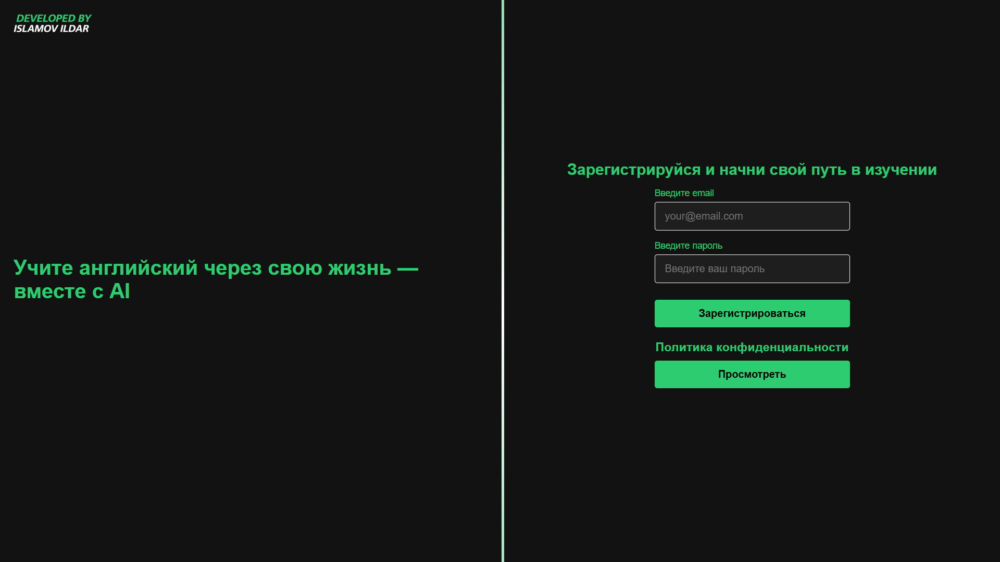

AI English Learning App 🇬🇧🤖

An interactive app for learning English using artificial intelligence. The project was created to demonstrate front-end development skills and integration with cloud databases.

🚀 Features
- User registration: Implemented via Supabase Auth.
- Interactive UI: Dynamic animations on the main screen that respond to mouse movement.
- Security: Hidden environment variables, use of `config.example.js` and a configured `.gitignore`.
- Database architecture: Currently, user registration is implemented using email and password in Supabase Auth, with other registration options to come. Two tables, users and user_profiler, are already in place for registration and user profile settings.

🛠 Tech stack
- Frontend: HTML5, CSS3 (Flexbox, Keyframes), JavaScript (ES6 Modules).
- Backend-as-a-Service: Supabase (Auth & Database).
- Tools: Git, VS Code.

🛡 Security and Architecture
The project implements a professional approach to data storage:
1. API keys are stored in environment variables.
2. Row Level Security (RLS) rules are configured in Supabase to protect tables.
3. Semantic form layout is used to ensure correct data processing.

📦 How to run the project locally
1. Clone the repository: `git clone https://github.com/Ildar69/ai-english-learning.git`
2. Create a `config.js` file based on `config.example.js`.
3. Paste your Supabase keys.
4. Run via Live Server in VS Code.
---------------------------------------------------------------------------------------------------
AI English Learning App 🇬🇧🤖

Интерактивное приложение для изучения английского языка с использованием искусственного интеллекта. Проект создан как демонстрация навыков фронтенд-разработки и интеграции с облачными базами данных.

🚀 Функционал
- Регистрация пользователей: Реализована через Supabase Auth.
- Интерактивный UI: Динамические анимации на главном экране, реагирующие на движение мыши.
- Безопасность: Скрытые переменные окружения, использование `config.example.js` и настроенный `.gitignore`.
- Архитектура базы данных: На данный момент реализована регистрация пользователя по почте и паролю в Supabase auth, будут и другие варианты регистрации. Уже есть две таблицы, users и user_profiler для регистрации и настройки профиля пользователя.

🛠 Технологический стек
- Frontend: HTML5, CSS3 (Flexbox, Keyframes), JavaScript (ES6 Modules).
- Backend-as-a-Service: Supabase (Auth & Database).
- Инструменты: Git, VS Code.

🛡 Безопасность и архитектура
В проекте реализован профессиональный подход к хранению данных:
1. Ключи API вынесены в переменные окружения.
2. Настроены правила Row Level Security (RLS) в Supabase для защиты таблиц.
3. Использована семантическая верстка форм для корректной обработки данных.

📦 Как запустить проект локально
1. Клонируйте репозиторий: `git clone https://github.com/Ildar69/ai-english-learning.git`
2. Создайте файл `config.js` на основе `config.example.js`.
3. Вставьте ваши ключи от Supabase.
4. Запустите через Live Server в VS Code.
